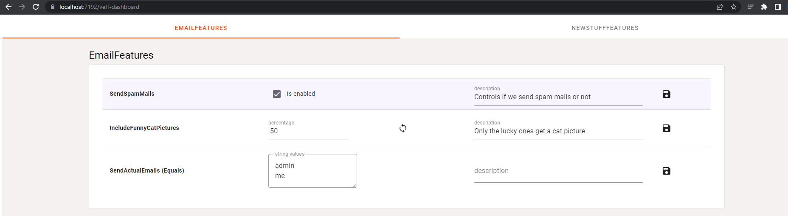

## Veff -> Very easy feature flags


Well it's easy if you use aspnet core :) 

Currently supports 3 types of feature flags. 
BooleanFlag, StringFlag and PercentageFlag.

- **Boolean** is a simple true/false
- **String** can be assigned multiple strings. Case insensitive. Could be useful for emails, auth-roles etc.   
    - can be found in different versions - StringEquals, Contains, StartsWith and EndsWith.
- **Percentage** set between 0-100%. Will take a Guid or int and give back true/false x% of the time. The results are repeatable,  
so i.e. a Guid will always evaluate to true for a given percentage, unless you set a new 'randomSeed' on the flag.  

In addition you can enable a management dashboard where you can see and control your flags.  
If you need to access the flags from another service or website, you can add a simple external api where external services can ask for the flags and what they would give back for a given value.

### Usage

Create a normal c# class or record, and add the Flags you want as normal get-only properties.
Remember to 'implement' the empty marker interface `IFeatureFlagContainer`.   

You do not have to set the Flags to anything (e.g. BooleanFlag.Empty as I do below). It is only really useful for calming the roslyn analyzer if you have nullable reference types enabled.

```C#

public class EmailFeatures : IFeatureFlagContainer
{
    public BooleanFlag SendSpamMails { get; } = BooleanFlag.Empty;
    public PercentageFlag IncludeFunnyCatPictures { get; } = PercentageFlag.Empty;
    public StringEqualsFlag SendActualEmails { get; } = StringEqualsFlag.Empty;
}

```


### Setup

Super simple example of an aspnetcore website with Veff added and configured.

`dotnet add package Veff.SqlServer`

then in Program.cs
```C# 

var builder = WebApplication.CreateBuilder(args);

builder.Services.AddVeff(veffBuilder =>
{
    var connectionString = builder.Configuration.GetConnectionString("SqlDb")!;

    veffBuilder
        .WithSqlServer(connectionString, TimeSpan.FromSeconds(30))
        .AddFeatureFlagContainersFromAssembly() // Finds all IFeatureFlagContainer in scanned assemblies 
        .AddDashboardAuthorizersFromAssembly() // Same as above but for IVeffDashboardAuthorizers (only needed if you want to use the dashboard, and hide it behind some authorization)
        .AddExternalApiAuthorizersFromAssembly(); // Same as above but for IVeffExternalApiAuthorizers (only needed if you want to use the external api and hide it behind some auth)
});

var app = builder.Build();

app.UseVeff(s =>
{
    s.UseVeffDashboard(); // setup dashboard where you can manage and edit your feature flags. 
    s.UseVeffExternalApi(); // exposes a http api that allows external services to make use of the feature flags.
});

app.MapGet("/", ([FromServices] EmailFeatures ef)  // Just inject your FeatureFlagContainers via normal DI
    => $"{ef.SendSpamEmails.IsEnabled}\n{ef.SendActualEmails.EnabledFor("me")}");

app.Run();

```

#### Note

The FeatureContainers does not care about the data they are initialized with, it will be overridden with whats stored in the db. This also means that flags defaults to false until otherwise specified in the dashboard.


### Dashboard

Can be enabled with the call to `UseVeffDashboard()` option in the veff config builder.
Provide a url path or use the default of veff-dashboard.  
This allows you to manage the flags you added.

As an example see what the previously shown `EmailFeatures : IFeatureFlagContainer` looks like in the dashboard.



(help needed to make this dashboard less of an eye sore)


### External API

Can be added with the `UseVeffExternalApi()` option in the veff config builder. Here you can also set the `baseApiPath`

Send GET REQUESTs to `{baseApiPath}/eval` with params  
- containername
- name
- value (optional, depending on the flag requested)


Container name and name can be found via if you send a GET request to the `{baseApiPath}`. This returns a list of all Flags and their types, container names and flag names. 
The value provided is what you want to evaluate the flag against. So it doesn't make sense for a Boolean flag, but is needed for i.e. a string flag. 

### Testing

How do you test class that injects a feature container - since it is not hidden behind an interface?  
Example:

```C#

    public interface IMySuperService
    {
        string DoStuff();
    }

    public class MySuperService : IMySuperService
    {
        private readonly FooBarFeatures _fooBarFeatures;

        public MySuperService(FooBarFeatures fooBarFeatures)
        {
            _fooBarFeatures = fooBarFeatures;
        }
        
        public string DoStuff()
        {
            return _fooBarFeatures.Foo.IsEnabled ? "Hello" : "goodbye";
        }
    }

```

Luckily you can easily test by initializing the FeatureContainer with **MockedFlags**

```C#

    public class MySuperServiceTest
    {
        private readonly MySuperService _sut;

        public MySuperServiceTest()
        {
            var fooBarFeatures = new FooBarFeatures
            {
                Foo = new MockedBooleanFlag(true),
                Baz = new MockedStringFlag("my@email.com")
            };

            _sut = new MySuperService(fooBarFeatures);
        }
        
        [Fact]
        public void Test1()
        {
            var doStuff = _sut.DoStuff();
            Assert.Equal("Hello", doStuff);
        }
    }


```
