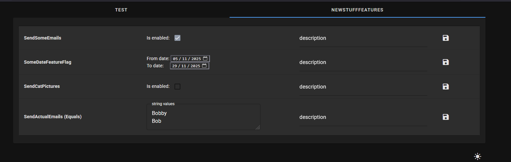

## Veff -> Very easy feature flags


Well it's easy if you use aspnet core :) 

Currently supports 4 types of feature flags. 
BooleanFlag, StringFlag, DateFlag and PercentageFlag.

- **Boolean** is a simple true/false
- **String** can be assigned multiple strings. Case insensitive. Could be useful for emails, auth-roles etc.   
    - can be found in different versions - StringEquals, Contains, StartsWith and EndsWith.
- **Percentage** set between 0-100%. Will take a Guid or int and give back true/false x% of the time. The results are repeatable,  
so i.e. a Guid will always evaluate to true for a given percentage, unless you set a new 'randomSeed' on the flag.  
- **Date** - add a optional *from* and an optional *to* date to describe when the feature is enabled. To be enabled the date must be after the from date (or no from date set),
and before the to date (or no to date set). If neither of the *from* and *to* dates are set, the flag will always be false.

In addition you can enable a management dashboard where you can see and control your flags.  
If you need to access the flags from another service or website, you can add a simple external api where external services can ask for the flags and what they would give back for a given value.

### Usage

Create a normal c# class or record, and add the Flags you want as a normal required property with {get; init;}.
Remember to 'implement' the empty marker interface `IFeatureFlagContainer`.   

```C#

public class NewStuffFeatures : IFeatureFlagContainer
{
     [FlagName("SendSomeEmails")]
     [InitialFlagValue(true)]
     public required BooleanFlag Hello { get; init; }
     
     public required BooleanFlag SendCatPictures { get; init; } 
     
     [InitialFlagValue("Bobby")]
     public required StringEqualsFlag SendActualEmails { get; init; } 

     [InitialFlagValue(null, "2025/11/30")]
     public required DateFlag SomeDateFeatureFlag { get; init; }
}

public class EmailFeatures : IFeatureFlagContainer
{
     [InitialFlagValue(true)]
     [FlagName("SendSomeEmails", ContainerName = "test")]
     public required BooleanFlag SendSpamMails { get; set; }

}


```

#### Attributes

Use the InitialFlagValue attribute to set the feature flag to your desired state on the initial run. After you change the value in the database, the InitialFlagValue attribute no longer does anything.   
Another attribute is the FlagName where you can give the flag another name than the property name. Useful i.e. if you want the dashboard to show another name than what is in the code. It also makes it more resilient to renaming of the flag properties.


### Setup

Super simple example of an aspnetcore website with Veff added and configured.

`dotnet add package Veff.SqlServer`

then in Program.cs
```C# 

var builder = WebApplication.CreateBuilder(args);

builder.Services.AddVeff(veffBuilder =>
{
    veffBuilder
        .AddSqlServer("someconnection;", TimeSpan.FromSeconds(5))
        .AddFeatureFlagContainersFromAssembly() // Finds all IFeatureFlagContainer in scanned assemblies
        .AddDashboardAuthorizersFromAssembly() // Finds and enables all IVeffDashboardAuthorizers (only needed if you want to use the dashboard, and hide it behind some authorization)
        .AddExternalApiAuthorizersFromAssembly(); // Same as above but for IVeffExternalApiAuthorizers (only needed if you want to use the external api and hide it behind some auth)
});


var app = builder.Build();

await app.UseVeff(s =>
{
    s.UseVeffDashboard(); // enables the dashboard where you can update the flag values
    s.UseVeffExternalApi(); // enables exposes a http api that allows external services to make use of the feature flags
});


// example usage
app.MapGet("/", ([FromServices]EmailFeatures emailFeatures, [FromServices] NewStuffFeatures newStuffFeatures) => 
$"""

SendSpamMails = {emailFeatures.SendSpamMails.IsEnabled}

SendActualEmails = {newStuffFeatures.SendActualEmails.EnabledFor("Bobby")}

Hello.Name = {newStuffFeatures.Hello.IsEnabled}

SomeDateFeatureFlag = {newStuffFeatures.SomeDateFeatureFlag.IsEnabledNow()}

""");

app.Run();

```

### Dashboard

Can be enabled with the call to `UseVeffDashboard()` option in the veff config builder.
Provide a url path or use the default of veff-dashboard.  
This allows you to manage the flags you added.

As an example see what the previously shown `EmailFeatures : IFeatureFlagContainer` looks like in the dashboard.



### External API

Can be added with the `UseVeffExternalApi()` option in the veff config builder. Here you can also set the `baseApiPath`

Send GET REQUESTs to `{baseApiPath}/eval` with params  
- containername
- name
- value (optional, depending on the flag requested)


Container name and name can be found via if you send a GET request to the `{baseApiPath}`. This returns a list of all Flags and their types, container names and flag names. 
The value provided is what you want to evaluate the flag against. So it doesn't make sense for a Boolean flag, but is needed for i.e. a string flag. 

### Testing

How do you test class that injects a feature container - since it is not hidden behind an interface?  
Example:

```C#

    public interface IMySuperService
    {
        string DoStuff();
    }

    public class MySuperService : IMySuperService
    {
        private readonly FooBarFeatures _fooBarFeatures;

        public MySuperService(FooBarFeatures fooBarFeatures)
        {
            _fooBarFeatures = fooBarFeatures;
        }
        
        public string DoStuff()
        {
            return _fooBarFeatures.Foo.IsEnabled ? "Hello" : "goodbye";
        }
    }

```

Luckily you can easily test by initializing the FeatureContainer with **MockedFlags**

```C#

    public class MySuperServiceTest
    {
        private readonly MySuperService _sut;

        public MySuperServiceTest()
        {
            var fooBarFeatures = new FooBarFeatures
            {
                Foo = new MockedBooleanFlag(true),
                Baz = new MockedStringFlag("my@email.com")
            };

            _sut = new MySuperService(fooBarFeatures);
        }
        
        [Fact]
        public void Test1()
        {
            var doStuff = _sut.DoStuff();
            Assert.Equal("Hello", doStuff);
        }
    }

```
